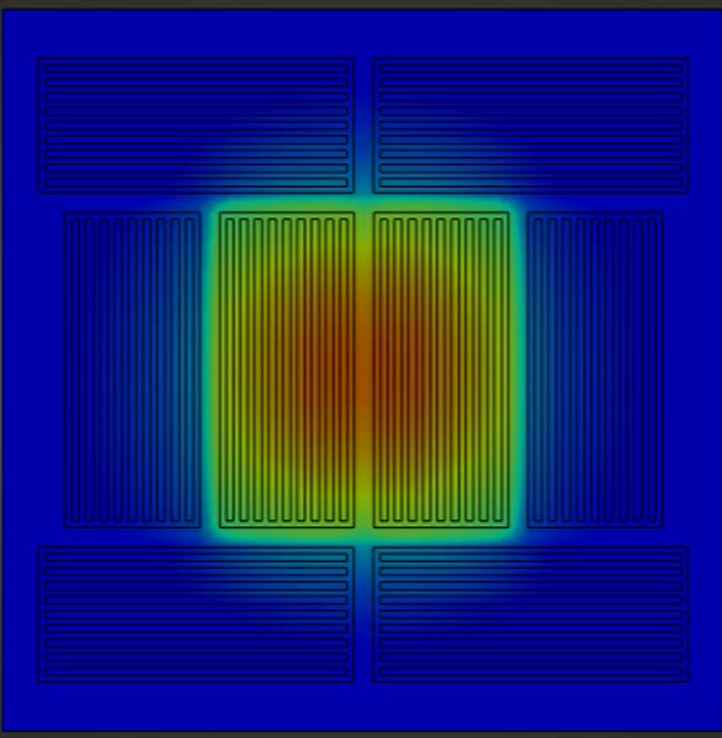
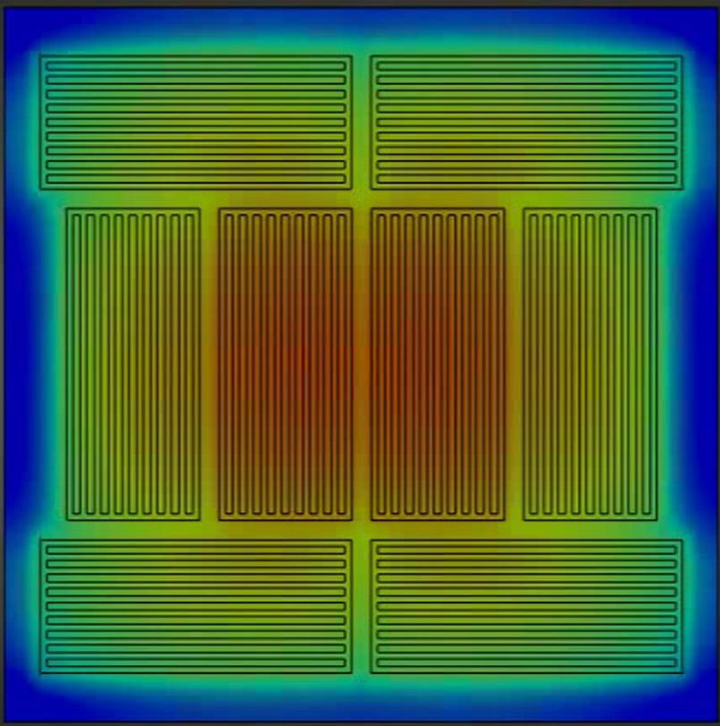

# 🔥 Energy-Efficient Heated Bed System for FDM 3D Printing

> **Interdisciplinary Engineering Project | TU Clausthal | WiSe 2024/2025**
> Master Program: Intelligent Manufacturing
> Team (Group B7 — Avant Garde): Nikhil Vinayagamurthy, Ashwanth Kumar C R, Dilip Jadhav N R, Hithesh Alen D Costa

---

## 📌 Project Overview

Designed and developed an **energy-efficient modular heated bed system** for FDM 3D printers as part of the Interdisciplinary Engineering Project at TU Clausthal. The project aimed to address recurring problems in university lab 3D printing environments — including warping, poor bed adhesion, and high energy waste — by designing a smarter, zone-controlled heating solution.

The system achieved a **stable bed temperature of ~70°C** within approximately **8 minutes**, making it suitable for common FDM materials such as **PETG and TPU**.

---

## 🎯 Objectives

- Improve **temperature uniformity** across the print bed
- Reduce **energy consumption** by activating only the zones needed
- Ensure **operational safety** with overheating protection
- Build a working **prototype** and validate with thermal simulation

---

## 🔧 System Design

### Heated Bed Construction

| Component | Description |
|---|---|
| Print surface | Glass (borosilicate) for flatness and adhesion |
| Heating layer | Aluminum foil resistive heating elements |
| Heating coils | Modular zone layout for selective activation |
| Insulation | Thermal insulation layer to reduce heat loss |
| Control electronics | Arduino with MOSFET switching circuit |
| Temperature sensors | 5 thermistors (1 ambient + 4 distributed across bed) |

### Two Heating Modes

| Mode | Zones Active | Best For |
|---|---|---|
| **Center-bed heating** | Center zones only | Small parts — saves energy |
| **Full-bed heating** | All zones | Larger prints requiring full surface |

### Electronics

- **Arduino** microcontroller for temperature monitoring and control
- **MOSFET switching** for high-current zone control
- Resistors, capacitors, push-button controls, and breadboard circuitry
- Temperature readings logged every **5 seconds** via Serial monitor

---

## 💻 Arduino Code

The temperature monitoring system uses **5 NTC thermistors** with the **Beta parameter formula** for accurate Kelvin-to-Celsius conversion.

📄 **[View Arduino Sketch](final__5_thermisters.ino)**

### How it works:
- Thermistors connected to analog pins A2–A6
- ADC readings converted to voltage → resistance → temperature
- Beta value: **3950**, Reference resistance: **100kΩ at 25°C**
- Readings from all 5 sensors printed to Serial every **3 seconds**

```cpp
// Beta parameter temperature calculation
float temperature = 1.0 / (1.0/T0 + (1.0/B) * log(thermistorResistance / R0));
temperature -= 273.15; // Convert Kelvin to Celsius
```

---

## 🖥️ Thermal Simulation (ANSYS Workbench)

Thermal simulations were performed in **ANSYS Workbench** to analyse heat distribution and optimise heater placement before building the prototype.

### Center Bed Heating — Small Part Printing

*Localized heating of the center region — energy-efficient for small parts*

### Full Bed Heating — Large Part Printing

*All zones active — uniform heat distribution across the entire bed*

### 🎬 Simulation Videos

> 📹 **[Center Bed Heating Simulation Video](https://drive.google.com/file/d/17nfuhDi8q5KBFTc4tMstnj3G_T9JQ2PG/view?usp=sharing)** ← *(Replace with Google Drive link)*
> 📹 **[Full Bed Heating Simulation Video](https://drive.google.com/file/d/1hvdnFKVsfraz4R3TLSu21DAScEUra7aI/view?usp=sharing)** ← *(Replace with Google Drive link)*

---

## 🔬 Prototype & Results


*Working prototype with Arduino-based temperature monitoring. Five thermistors measure temperature distribution across the bed.*

### Key Results

- ✅ Stable bed temperature of **~70°C** achieved
- ✅ Heating time of approximately **8 minutes**
- ✅ Compatible with **PETG** and **TPU** filament materials
- ✅ Dual heating modes reduce unnecessary energy consumption
- ✅ 5-sensor array confirms temperature uniformity across zones

---

## 🔑 Key Functions Implemented

1. **Temperature Uniformity** — Even heat distribution across the print surface
2. **Bed Temperature Maintenance** — Stable temperature control during printing
3. **Heating Efficiency** — Zone-based activation reduces wasted energy
4. **Heat Loss Reduction** — Insulation layer minimises thermal losses
5. **Overheating Protection** — Safety cutoff via thermistor monitoring

---

## 📊 Tools & Skills


- ANSYS Workbench (thermal simulation & heat distribution analysis)
- Arduino IDE (temperature monitoring firmware)
- FDM 3D printing & additive manufacturing
- Modular electronics design (MOSFET, thermistors, breadboard)
- Design thinking & iterative prototyping

---

## 📁 Repository Structure

```
3d-printer-heated-bed-system/
│
├── Center_Bed_Heating_Simulation__Small_Part_Printing_.png
├── Full_Bed_Heating_Simulation__Large_Part_Printing_.png
├── Prototype_Heated_Bed_with_Temperature_Monitoring_System.png
├── final__5_thermisters.ino   ← Arduino temperature monitoring code
├── LICENSE
├── .gitignore
└── README.md
```

---

## 🏫 Affiliation

**Technische Universität Clausthal**
Master Program — Intelligent Manufacturing
Interdisciplinary Engineering Project | WiSe 2024/2025

---

*This project was completed as part of the Interdisciplinary Engineering Project course at TU Clausthal, focused on sustainability in 3D printing.*
